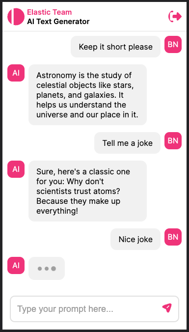

<div align="center">

  
  <h1>OpenAI Text Generator Challenge</h1>
  
  <p>
    A polished, user-friendly web application that leverages OpenAI's API to generate text based on user prompts 
  </p>

<h4>
    <a href="https://ai-text-generator-challenge.netlify.app">View Demo</a>
  <span> · </span>
    <a href="https://github.com/liltrendi/ai-text-generator-challenge/issues/">Report Bug</a>
  <span> · </span>
    <a href="https://github.com/liltrendi/ai-text-generator-challenge/issues/">Request Feature</a>
  </h4>
</div>

<br />

<!-- Table of Contents -->

# :notebook_with_decorative_cover: Table of Contents

-   [About the Project](#star2-about-the-project)
    -   [Live Demo](#triangular_flag_on_post-live-demo)
    -   [Screenshots](#camera-screenshots)
    -   [Tech Stack](#space_invader-tech-stack)
    -   [Features](#dart-features)
    -   [Color Reference](#art-color-reference)
    -   [Environment Variables](#key-environment-variables)
-   [Getting Started](#toolbox-getting-started)
    -   [Prerequisites](#bangbang-prerequisites)
    -   [Installation](#gear-installation)
    -   [Run Locally](#running-run-locally)
    -   [Running Tests](#test_tube-running-tests)
    -   [Deploying the app](#deploying-the-app)
-   [License](#warning-license)
-   [Contact](#handshake-contact)
-   [Acknowledgements](#gem-acknowledgements)

<!-- About the project -->

## :star2: About the Project

This is a submission for [this event](https://community.distributed.com/networks/events/117733) by Distributed, whose challenge is to build an operational AI-powered conversational interface that interacts with OpenAI to give responses based on user input.

For reference, the challenge details are on this page: [Distributed Challenge](https://649cd07e63b6a10f6bd568d0--gentle-cat-7fd94b.netlify.app/challenge)

<!-- Live Demo -->

### :triangular_flag_on_post: Live Demo

This web app is hosted on [Netlify](https://netlify.com) (crucial choice as I needed to use their identity service for authentication). You can try it out here: [OpenAI Text Generator Challenge](https://ai-text-generator-challenge.netlify.app)

<!-- Screenshots -->

### :camera: Screenshots

<div align="left"> 
  
</div>

<!-- TechStack -->

### :space_invader: Tech Stack

<details>
  <summary>Frontend</summary>
  <ul>
    <li><a href="https://reactjs.org/">React.js</a> - viewing library</li>
    <li><a href="https://www.typescriptlang.org/">Typescript</a> - type safety</li>
    <li><a href="https://styled-components.com/">Styled components</a> - styles organization</li>
    <li><a href="https://storybook.js.org/">Storybook</a> - component library</li>
    <li><a href="https://nextjs.org/">Next.js</a> - static site generator</li>
  </ul>
</details>

<details>
  <summary>Backend</summary>
  <ul>
    <li><a href="https://netlify.com">Netlify</a> - deployment</li>
    <li><a href="https://docs.netlify.com/visitor-access/identity/">Identity</a> - authentication</li>
    <li><a href="https://www.netlify.com/products/functions/">Cloud Functions</a> - lambda endpoints</li>
    <li><a href="https://developer.mozilla.org/en-US/docs/Web/API/IndexedDB_API">IndexedDB</a> - local message persistence</li>
  </ul>
</details>

<!-- Features -->

### :dart: Features

-   Login
-   Signup
-   Chat

<!-- Color Reference -->

### :art: Color Reference

| Color         | Hex                                                                    |
| ------------- | ---------------------------------------------------------------------- |
| White         |  #ffffff       |
| Light White 1 |  #f1f1f1       |
| Light White 2 |  #e0e0e0       |
| Light Gray 1  |  #a4a9bf       |
| Light Gray 2  |  #9f9f9f       |
| Mid Gray      |  #656c8c       |
| Dark Gray     |  #2d3142       |
| Pink          |  #ff007a       |
| Green         |  #46b455       |
| Black         |  #000000       |
| Black 1       |  #00000033 |
| Red           |  #FF0000       |
| Transparent   |  #00000000 |

<!-- Env Variables -->

### :key: Environment Variables

To run this project, create a `.env` file first, then copy the contents of the `.env.sample` file and paste them in the created file. Finally, obtain the relevant keys and use them in the newly created `.env` file.

<!-- Getting Started -->

## :toolbox: Getting Started

<!-- Prerequisites -->

### :bangbang: Prerequisites

This project uses [npm](npmjs.com) as package manager (version 17.19.1 of [Node.js](https://nodejs.org) was used). You will also need [Git](https://git-scm.com) installed.

<!-- Installation -->

### :gear: Installation

Open up a terminal, clone (download) the project from [Github](https://github.com/liltrendi/ai-text-generator-challenge), and navigate to it:

```bash
  git clone https://github.com/liltrendi/ai-text-generator-challenge
```

<!-- Run Locally -->

### :running: Run Locally

Go to the project directory

```bash
  cd ai-text-generator-challenge
```

Install dependencies

```bash
  npm install
```

Start the server

```bash
  npm run dev
```

The project uses Netlify functions as its API endpoint. To be able to test these functions locally, you need `netlify-cli`:

```bash
  npm i -g netlify-cli
```

The lambdas are served from the `lambdas` directory, as specified in the `netlify.toml`. To run them locally:

```bash
  netlify dev
```

The above command will authenticate with your Netlify account, package your functions and run them. Once your local tests are complete, you can deploy them to production:

```bash
  netlify deploy --prod
```

Remember to set your `env` variables on the Netlify UI as well.

<!-- Running Tests -->

### :test_tube: Running Tests

To run one-off tests, run the following command

```bash
  npm test
```

Run the following to have the reload on code changes:

```bash
  npm run test:watch
```

Update snapshots using:

```bash
  npm run test:updatesnapshots
```

Generate coverage reports with:

```bash
  npm run test:coverage
```

<!-- Deploying the app -->

### :bomb: Deploying the app

You will need a [Github](https://github.com) account, and a [Netlify](https://netlify.com) account.

This [guide](https://www.netlify.com/blog/2020/11/30/how-to-deploy-next.js-sites-to-netlify/) provides a step by step procedure for how you can connect your repository and deploy the site on Netlify. The Netlify UI options is more straightforward.

Basically:

1. Visit [this](https://app.netlify.com/start) page (you will have to authorize Netlify on your github account).
2. Pick your repo to import it into Netlify.
3. For site configuration, leave the defaults as is (branch to deploy should be `main`, build command should be `npm run build`, publish directory should be `.next`).
4. Click on the `Advanced` button to expand more configiration options. Here you can set your environment variables, and make sure the "functions directory" is `lambdas` (this should already be set through the `netlify.toml` file).
5. Click on `Deploy Site`.

To set up authentication, we use Netlify's Identity.

1. Head over to your site that you just deployed, under `Site configuration`, click `Identity`.
2. Under `Registration`, make sure it says `open`, rather than `invite only`. This allows anyone to sign up.
3. Under `Confirmation template`, click "Configure" and set "Autoconfirm" to `Yes`. This helps to avoid the confirmation process which would otherwise break the user journey for this challenge.

That should be it!

<!-- License -->

## :warning: License

Distributed under the MIT license. See LICENSE for more information.

<!-- Contact -->

## :handshake: Contact

Your Name - [Brian Njogu](https://brayo.co) - briancanspit@gmail.com

Project Link: [https://github.com/liltrendi/ai-text-generator-challenge](https://github.com/liltrendi/ai-text-generator-challenge)

<!-- Acknowledgments -->

## :gem: Acknowledgements

-   [Awesome README](https://github.com/Louis3797/awesome-readme-template)
